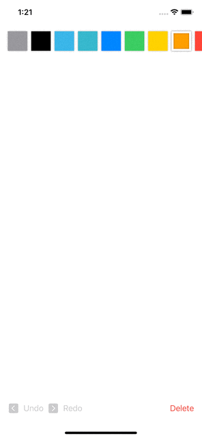

# DrawingApp
Using the new Canvas view in SwiftUI for iOS 15+ and macOS 12+


 
 
 
 The drawing is done with Canvas in DrawingView.swift
 ```
 Canvas { context, size in
                for line in lines {
                    let path = createPath(for: line.points)
                    context.stroke(path,
                        with: .color(line.color),
                        lineWidth: 4)
                }
            }
```

The context works similar to CGContext when drawing in UIKit. You get information on the area of the canvas with propertiy size: CGSize.
Here are some other things you can draw:


 ```
 // systemIcon
   let image = Image(systemName: "trash")
   context.draw(iimage, at: CGPoint(x: 20 * (index + 1), y: 20))
    
 //shapes 
   path.addRect(CGRect(x: size.width * 0.1, y:  size.height * 0.1.y, width: 10, height: 10))
                   
 // move path
   path.move(to: CGPoint(x: 100, y: 100)
   
//draw lines
   path.addLines(line.points)
   path.addQuadCurve(to: CGPoint(x: 50, y: 10), control: line[index - 1])
  ```
